<picture>
  <source media="(prefers-color-scheme: light)" srcset="art/ascent-light.svg" />
  
</picture>

<samp>hi, i'm boom. i'm a fourth-year engineering student at chulalongkorn university, and i spent this summer as a software engineer intern at <b>LINE MAN Wongnai</b> — there is code i wrote running in the back office their food-operations teams use every day, and that feeling is exactly why i do this. before that i helped rebuild <b>chula wise</b>, my university's alumni mentorship platform, on a student team supervised by skooldio.</samp>

<samp>the picture above is the honest version of my story. it starts on a football pitch, and it has been climbing ever since — the injury that ended the first dream is the reason i work the way i do on this one.</samp>

<samp>and since you're here, the part most profiles won't say out loud: next is a master's abroad (mcgill is the plan i'm working toward), a look at silicon valley with my own eyes — and then home. the goal hasn't moved since the football pitch: build things that make thailand better, whether that's companies, public work, or something i haven't named yet. that's why the last node up there has no label.</samp>

<!-- pulse starts -->

<samp>last shipped: "tokenizer study: unigram beats bpe 12/12, optimum 8k; r…" → saphagpt · 7d ago · this line rewrote itself at 23:47 bangkok time</samp>

<!-- pulse ends -->

<samp>$ cat story.log --verbose</samp>

 

<samp>age 10: signed to chonburi fc academy with one dream. an injury ended it. started over from zero — failed the first math test after leaving the sport — and earned a seat at chulalongkorn engineering (ICE, class of 2027).</samp>

<samp>spring 2026, chula wise (champ chula): full-stack developer on the student team that rebuilt chulalongkorn's alumni mentorship platform, supervised by skooldio — react, nestjs, gcp firestore, 139 merged commits, including the mentee-approval and admin-management workflows.</samp>

<samp>summer 2026, LINE MAN Wongnai (sally squad, food): built and shipped a deeplink generator (vue 3) that marketing, operations, and engineering adopted as their single source of truth · fixed a cross-squad go coupon-service bug, turning 3–4 working days of manual constraint entry into one upload across 90–100 campaigns/month · eliminated a silently failing upload with mongodb dual-write sync · guardrail validation in the reward service · unit tests on every shipped function + api acceptance tests, 10–15 MRs through senior review, beta → qa → uat.</samp>

<samp>everything pinned below is live. click around.</samp>

<samp><a href="https://techinboom.com">techinboom.com</a> · <a href="https://www.linkedin.com/in/techinchompoo">linkedin</a> · <a href="mailto:chompooborisuthtechin@gmail.com">email</a></samp>

